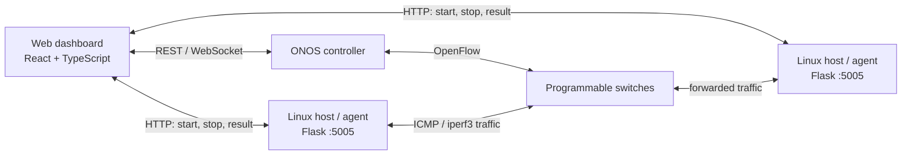

# SDN Network Monitoring and Traffic Control Platform

This project implements a physical Software-Defined Networking (SDN) laboratory connected to the **ONOS controller** and extended with an interactive web dashboard. It combines a real network of Linux hosts and programmable switches with a dashboard for inspecting topology, forwarding rules, traffic experiments, and performance measurements.

The project is an educational and experimental environment for understanding how SDN control-plane decisions affect real data-plane traffic.

## What was built

- A physical SDN network using Linux hosts and programmable switches, connected to ONOS for device, link, and host discovery.
- Extensions to an existing React dashboard for viewing the ONOS-discovered topology and interacting with flow rules and paths.
- Lightweight Flask agents running on Linux hosts. The dashboard can request ICMP, TCP, or UDP traffic tests and retrieve their results.
- A traffic-testing workflow for validating connectivity, bandwidth policies, and traffic paths in the real network.

## Architecture



ONOS provides the dashboard with the discovered network view. The dashboard uses each discovered host IP to contact its traffic agent on port `5005`. The agent runs `ping` or `iperf3` toward the selected destination and returns measurements to the dashboard.

## Main features

- **Topology visibility:** visual representation of hosts, switches, and links discovered by ONOS.
- **Flow-rule control:** inspection and modification of forwarding behavior through the dashboard.
- **Traffic generation:** ICMP Ping, TCP Bulk, and UDP CBR tests initiated from selected Linux hosts.
- **Performance metrics:** RTT and packet loss for ping; throughput, retransmissions, jitter, and packet loss for `iperf3`.
- **SDN policy validation:** experiments for forwarding-rule reachability, METER-based bandwidth limiting, and path steering.

## Technologies

| Layer | Technologies |
| --- | --- |
| SDN control plane | ONOS, OpenFlow |
| Network hosts | Linux, Python, Flask, `ping`, `iperf3` |
| Dashboard | React, TypeScript, Vite, Zustand, Cytoscape.js |
| Communication | REST APIs and WebSocket-based dashboard updates |

## Traffic-agent API

Each Linux host runs `Task3_Topology_Automation/HostAgent.py`, which listens on port `5005`.

| Endpoint | Purpose |
| --- | --- |
| `GET /health` | Confirms that the agent is reachable. |
| `GET /ping/<target>` | Runs the original direct ping check. |
| `POST /start` | Starts a ping or `iperf3` experiment. |
| `POST /stop` | Stops the active experiment. |
| `GET /result` | Returns completed experiment metrics. |

## SDN experiments

1. **Baseline connectivity:** verify that a forwarding rule enables reachability between two hosts; removing it should cause packet loss.
2. **Bandwidth limiting:** send UDP CBR traffic and compare measured throughput before and after applying an ONOS METER rule.
3. **Path steering:** send TCP traffic, change the forwarding path using flow rules, and observe the new active path in the topology.

## Repository structure

```text
sdn-dashboard/                React and TypeScript dashboard
Task3_Topology_Automation/    Linux traffic agent and network automation resources
docs/                         Setup, implementation, and testing guides
deploy/                       Deployment-related files
```

## Getting started

### Dashboard

```bash
cd sdn-dashboard
npm install
npm run dev
```

### Linux traffic agent

Install dependencies on every Linux host:

```bash
sudo apt update
sudo apt install python3 python3-flask iputils-ping iperf3 curl
```

Start the agent:

```bash
python3 Task3_Topology_Automation/HostAgent.py
```

The agent listens on `0.0.0.0:5005`. For TCP and UDP tests, start an `iperf3` server on the destination host:

```bash
iperf3 -s -D -p 5201
```

